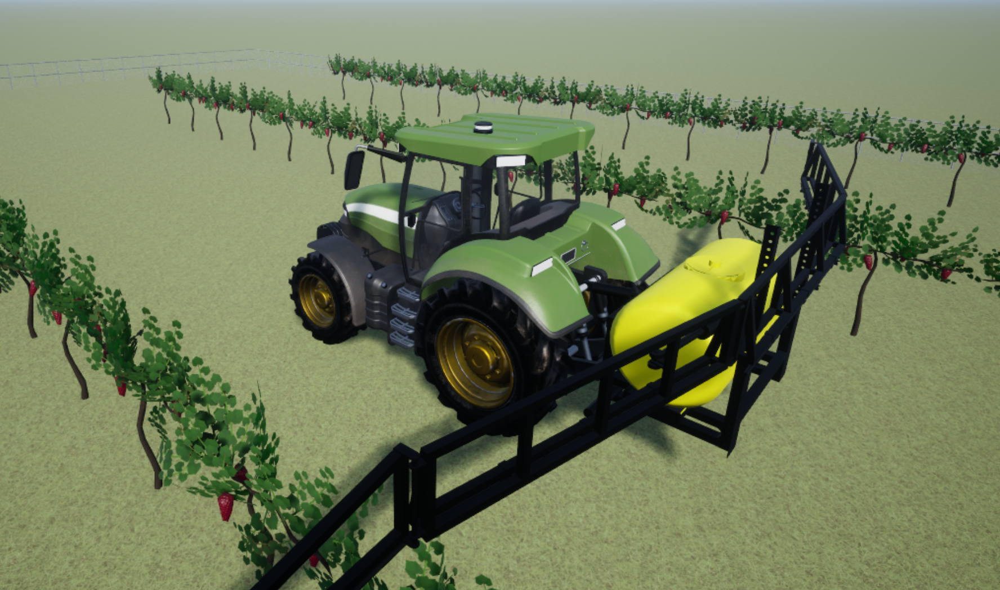

# Drive Sprayer-Equipped Tractor in Vineyard Using Unreal Engine
Agricultural applications have traditonally involved multiple stages of manual crop cultivation. These included soil preparation, plowing, seeding, adding fertilizer and pesticides, irrigation, and harvesting with the cycle repeating itself. 
With the modernization of farming equipment, these stages have become nearly fully automated, involving little to no manual intervention. 
This example focuses on starting the automation process of spraying pesticides on vineyard crops by first creating trajectories for driving a tractor between rows of crops in a vineyard.  
  
The Simulation 3D Animation™ toolbox in MATLAB® offers simulation and visualization of such dynamic systems in a photorealistic 3D environment.
This example shows you how to import and control a 3D tractor-sprayer actor in a custom 3D vineyard scene and then visualize the tractor-sprayer movement using an Unreal Engine® visualization environment.
You will use an Unreal Engine executable to load the vineyard scene and drive the tractor-sprayer vehicle between rows of grapevines for spraying.  
   

## Requirements
- [MATLAB® R2024b](https://www.mathworks.com/products/matlab.html)
- [Simulink®](https://www.mathworks.com/products/simulink.html)
- [Simulation 3D Animation™](https://www.mathworks.com/products/3d-animation.html)
- [Automated Driving Toolbox™](https://www.mathworks.com/products/automated-driving.html)
- [Image Processing Toolbox™](https://www.mathworks.com/products/image.html)
- [Robotics System Toolbox™](https://www.mathworks.com/products/robotics.html)(Optional)
  
***Note***: The example can only be run in a Windows OS and in MATLAB R2024b.

## Getting Started

Download or clone this repository to your machine and open it in MATLAB®.

Open and run the `SimulateTractorSprayerDriveInVineyardUsingUnrealEngineExample.mlx` file.

## License
The license is available in the license.txt file in this GitHub repository.

## Community Support
[MATLAB Central](https://www.mathworks.com/matlabcentral)

Copyright 2024 The MathWorks, Inc.

## Reporting Security Vulnerabilities 

If you believe you have discovered a security vulnerability, please report it to 
[security@mathworks.com](mailto:security@mathworks.com). Please see 
[MathWorks Vulnerability Disclosure Policy for Security Researchers](https://www.mathworks.com/company/aboutus/policies_statements/vulnerability-disclosure-policy.html) 
for additional information.  

